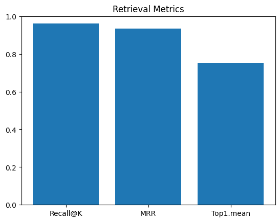
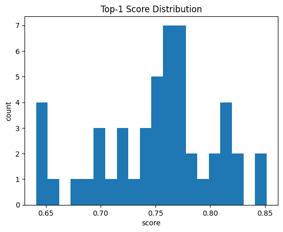
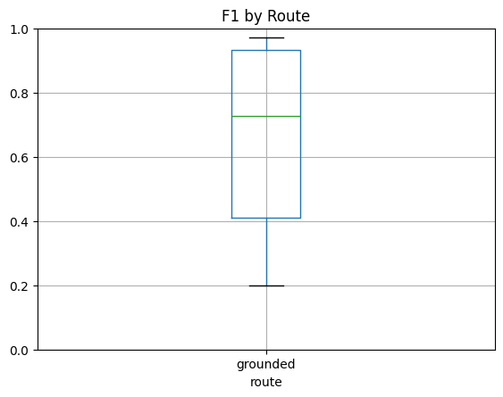

# GDPR RAG Assistant


A Retrieval-Augmented Generation (RAG) chatbot that answers questions about the **EU GDPR** using a vectorized corpus of Articles and Recitals. The system prioritizes grounded answers with citations, gracefully falls back when the dataset doesn’t contain the answer, and handles off-topic questions neutrally.

* **Backend:** FastAPI + Azure OpenAI + Azure AI Search
* **RAG Core:** Three-tier logic (Grounded → Hybrid → Off-topic)
* **Frontend:** Lightweight SPA (HTML/CSS/JS) with citations and a 3D retrieval viz
* **Deploy:** Docker + (optionally) Azure Container Apps

---


---


---

## Table of Contents

* [Demo](#demo)
* [Architecture](#architecture)
* [Dataset](#dataset)
* [Getting Started](#getting-started)
* [Configuration](#configuration)
* [Run Locally](#run-locally)
* [API Reference](#api-reference)
* [Frontend](#frontend)
* [Deployment (Azure Container Apps)](#deployment-azure-container-apps)
* [Evaluation & Testing](#evaluation--testing)
* [Troubleshooting](#troubleshooting)
* [Roadmap](#roadmap)
* [Citation](#citation)
* [License](#license)

---

## Demo

**Capabilities**

* Grounded answers with citations (when the dataset has coverage)
* Explicit fallback when no direct answer is found; concise expert guidance
* Off-topic handling without misleading citations
* Optional 3D visualization of retrieved chunks for the last turn (Plotly) 

---

## Architecture

### Three-tier logic (as implemented)

* **Grounded Answer (GDPR Dataset)** — Only uses retrieved context; if the answer isn’t explicitly present, outputs a sentinel string signaling “no answer from dataset”.
* **Hybrid GDPR Guidance** — When the dataset yields no direct answer (or match is weak), clearly says so, then provides a concise expert explanation.
* **Off-topic Neutral Answer** — For non-GDPR questions, provides a short, factual reply and **no** dataset sources.

> Entrypoints:
>
> * Backend: `app/main.py` → `/api/chat` calls `rag_answer()`
> * RAG: `app/rag.py` (classification → retrieval → branch → answer)

---

## Dataset

We use the **GDPR Articles & Recitals** dataset (Hugging Face: `AndreaSimeri/GDPR`), which includes:

* **99 Articles** across 11 chapters
* **173 Recitals** providing interpretive guidance

Key example: Article **7(2)** (Conditions for consent) is informed by Recital **42**, clarifying proof of consent and informed identity/purpose.

The frontend’s **Dataset** panel links to the dataset and includes the paper reference; it’s wired in `web/app.js` and rendered by `web/index.html`.

**Reference:**
Simeri, A. and Tagarelli, A. (2023). *GDPR Article Retrieval based on Domain-adaptive and Task-adaptive Legal Pre-trained Language Models*. LIRAI 2023 (CEUR Vol. 3594), pp. 63–76.

---

## Getting Started

### Prerequisites

* Python 3.10+
* Azure subscription with:

  * **Azure OpenAI** (deployed Chat + Embedding models)
  * **Azure AI Search** (index preloaded with GDPR chunks)

### Install dependencies

> Dependency highlights:
>
> * OpenAI/Azure OpenAI SDKs + LangChain providers
> * Azure AI Search SDK
> * FastAPI + Uvicorn
>   See `requirements.txt`. 

### Method 1: Replicate the Virtual Enviroment
Use the `requirements.txt` to install all dependencies

```bash
python -m venv .venv
./.venv/bin/pip install -r requirements.txt
```

### Method 2: Cloning the github repository and craeting Python Virtual environment
```bash
# Clone the repository
git clone https://github.com/BharAI-Lab/rag_azure_fastapi.git
# Move into the directory (Locally)
cd rag_azure_fastapi
# Create a python environment using python3.11
python3.11 -m venv venv
# Activate the virtual environment
source venv/bin/activate
# Install the dependencies
pip install -r requirements.txt
```
### Method 3: Using Conda Environment
 
```bash
# Clone the repository 
git clone https://github.com/BharAI-Lab/rag_azure_fastapi.git
# Create a conda environment
conda create -n rag_azure_fastapi  python=3.10 -y
# Activate conda environment 
conda activate rag_azure_fastapi
# Install all dependencies using requirements.txt file
pip install -r requirements.txt
```

---

## Configuration

All runtime configuration is centralized in `app/settings.py` and read from environment variables at startup.

**Required environment variables**

```
AZURE_OPENAI_ENDPOINT=
AZURE_OPENAI_KEY=
AZURE_OPENAI_API_VERSION=
AZURE_OPENAI_CHAT_DEPLOYMENT=
AZURE_OPENAI_EMBEDDING_DEPLOYMENT=
AZURE_SEARCH_ENDPOINT=
AZURE_SEARCH_API_KEY=
AZURE_SEARCH_INDEX_NAME=
```

**Optional tuning knobs**

```
TOP_K=4
TEMPERATURE=0.2
MAX_TOKENS=800
```

For local dev, create a `.env` file in the repo root; `python-dotenv` loads it automatically. In Azure, set these as container **Environment Variables / Secrets**.

---

## Run Locally

1. **Start the API**

```bash
uvicorn app.main:app --reload --port 8000
```

2. **Open the UI**
   Visit: `http://127.0.0.1:8000` → the SPA is served from `web/index.html` via `/static`. 

---

## API Reference

### POST `/api/chat`

**Request**

```json
{
  "message": "Within how many hours must a controller notify a data breach?"
}
```

**Response**

```json
{
  "answer": "The controller must notify ... not later than 72 hours ... (Article 33).",
  "sources": [
    {
      "article_id": "33",
      "article_title": "Notification of a personal data breach to the supervisory authority",
      "chunk_id": 12,
      "snippet": "…",
      "score": 0.78
    }
  ]
}
```

**Models (Pydantic)**

* `ChatRequest { message: str }`
* `Source { article_id: str, article_title: str, chunk_id: int, snippet: str, score: float }`
* `ChatResponse { answer: str, sources: Source[] }`

Defined in `app/schemas.py`.

---

## Frontend

A minimalist, dependency-free SPA (HTML + CSS + vanilla JS).

* **Chat UI**: sends `POST /api/chat` and renders markdown + citations (`web/app.js` → `send()`, `appendBot()`), with copy-to-clipboard and a “Jump to latest” helper. 
* **Panels**: **About**, **Dataset**, and **3D Viz** slide-in via a reusable side panel. Content is pre-baked in `app.js`; styles in `styles.css`.
* **Theme**: dark/light toggle persists in `localStorage` (`data-theme` attribute). 
* **3D Viz**: plots the last turn’s retrieved chunks on a unit sphere using approximate `acos(similarity)` for angles, with Plotly loaded by CDN in `index.html`.

**Key files**

* `web/index.html` — shell & asset loading 
* `web/styles.css` — look & feel (responsive, dark default) 
* `web/app.js` — chat logic, panels, 3D viz (Plotly) 

---

## Deployment (Azure Container Apps)

> Below assumes you have a working **Dockerfile** and the required env vars set as **secrets** in Azure.

### Build & run (local)

```bash
docker build -t gdpr-rag:latest .
docker run --rm -p 8000:8000 \
  --env-file .env \
  gdpr-rag:latest
```

### Push to registry (example: GitHub Container Registry)

```bash
docker tag gdpr-rag:latest ghcr.io/<org-or-user>/gdpr-rag:latest
docker push ghcr.io/<org-or-user>/gdpr-rag:latest
```

### Create Azure Container App (high level)

```bash
# login and select subscription first (az login / az account set)
az containerapp env create -g <rg> -n <env-name> --location <region>

az containerapp create -g <rg> -n gdpr-rag \
  --image ghcr.io/<org-or-user>/gdpr-rag:latest \
  --environment <env-name> \
  --target-port 8000 --ingress external \
  --env-vars \
    AZURE_OPENAI_ENDPOINT=... \
    AZURE_OPENAI_KEY=secretref:AZURE_OPENAI_KEY \
    AZURE_OPENAI_API_VERSION=... \
    AZURE_OPENAI_CHAT_DEPLOYMENT=... \
    AZURE_OPENAI_EMBEDDING_DEPLOYMENT=... \
    AZURE_SEARCH_ENDPOINT=... \
    AZURE_SEARCH_API_KEY=secretref:AZURE_SEARCH_API_KEY \
    AZURE_SEARCH_INDEX_NAME=...
```

---

## Evaluation & Testing

### What to measure

* **Retrieval**: Recall@K, MRR, top-1 score distribution
* **Answering**:

  * **Groundedness** (does the answer cite retrieved spans?)
  * **Exact Match / F1** vs. gold answers for a small curated set (30–50 Q/A)
* **Routing metrics**:

  * Rate of **Grounded** vs **Hybrid** vs **Off-topic**
  * **Hybrid triggers** due to sentinel vs. due to weak scores

### Offline Evaluation (visuals)




You can view the full interactive [**evaluation report (HTML)**](docs/report.html)
generated from the offline evaluation pipeline.

### Quick checks

* Build a `/api/debug/retrieve?q=...` (optional) to inspect top-K results and scores during tuning.
* Log `{ intent, top1_score, used_branch }` per request for offline analysis.

---

## Troubleshooting

* **No answer despite known coverage**
  Check the **top-1 score** coming back from Azure Search and the **threshold** (`RAG_STRONG_SCORE`, default behavior in code). Consider increasing `TOP_K`.

* **Empty sources or “No direct answer found…” often**
  Verify the **index schema**, **embedding model name**, and that embeddings were generated for both **documents** and (implicitly) the **query** at retrieval time.

* **CORS errors in browser**
  The API enables permissive CORS for demo. If you changed it, ensure your frontend origin is allowed.

* **Auth/Key errors**
  Confirm all env vars match the **deployment names** in Azure OpenAI and **keys**/endpoint for Azure AI Search.

---

## Roadmap

* Add `/healthz` (readiness/liveness) and `/metrics` (Prometheus) endpoints
* Inline citations (e.g., auto-append `[Article X]` tags) in grounded answers
* Hybrid retrieval (lexical + vector) for Azure AI Search
* Evaluation scripts (`/scripts/eval.py`) with a small gold Q/A set

---

## Generate a PAT

The access token will need to be added as an Action secret. [Create one](https://github.com/settings/tokens/new?description=Azure+Container+Apps+access&scopes=write:packages) with enough permissions to write to packages. It is needed because Azure will need to authenticate against the GitHub Container Registry to pull the image.

## Create an Azure Service Principal

You'll need the following:

1. An Azure subscription ID [find it here](https://portal.azure.com/#view/Microsoft_Azure_Billing/SubscriptionsBlade) or [follow this guide](https://docs.microsoft.com/en-us/azure/azure-portal/get-subscription-tenant-id)
1. A Service Principal with the following details the AppID, password, and tenant information. Create one with: `az ad sp create-for-rbac -n "REST API Service Principal"` and assign the IAM role for the subscription. Alternatively set the proper role access using the following command (use a real subscription id and replace it):

```
az ad sp create-for-rbac --name "CICD" --role contributor --scopes /subscriptions/$AZURE_SUBSCRIPTION_ID --sdk-auth
``` 


## Azure Container Apps

Make sure you have one instance already created, and then capture the name and resource group. These will be used in the workflow file.

## Change defaults 

Make sure you use 2 CPU cores and 4GB of memory per container. Otherwise you may get an error because loading HuggingFace with FastAPI requires significant memory upfront.

## Gotchas

There are a few things that might get you into a failed state when deploying:

* Not having enough RAM per container
* Not using authentication for accessing the remote registry (ghcr.io in this case). Authentication is always required
* Not using a `GITHUB_TOKEN` or not setting the write permissions for "packages". Go to `settings/actions` and make sure that "Read and write permissions" is set for "Workflow permissions" section
* Different port than 80 in the container. By default Azure Container Apps use 80. Update to match the container.

If running into trouble, check logs in the portal or use the following with the Azure CLI:

```
az containerapp logs  show  --name $CONTAINER_APP_NAME --resource-group $RESOURCE_GROUP_NAME --follow
```

Update both variables to match your environment


### Accept request types sparingly

| GET | POST | PUT | HEAD|
|---|---|---|---|
| Read Only | Write Only | Update existing | Does it exist? |

---

## API Best Practices

Although there are a few best practices for using the FastAPI framework, there are many different other suggestions to build solid HTTP APIs that can be applicable anywhere. 

### Use HTTP Error codes
The HTTP specification has several error codes available. Make use of the appropriate error code to match the condition that caused it. For example the `401` HTTP code can be used when access is unauthorized. You shouldn't use a single error code as a catch-all error.

Here are some common scenarios associated with HTTP error codes:

- `400 Bad request`: Use this to indicate a schema problem. For example if the server expected a string but got an integer
- `401 Unauthorized`: When authentication is required and it wasn't present or satisfied
- `404 Not found`: When the resource doesn't exist

Note that it is a good practice to use `404 Not Found` to protect from requests that try to find if a resource exists without being authenticated. A good example of this is a service that doesn't want to expose usernames unless you are authenticated.


---

## Citation

If you use the dataset or reference its methodology, please cite:

```
@inproceedings{SimeriGDPRLirai2023,
  author       = {Andrea Simeri and Andrea Tagarelli},
  title        = {GDPR Article Retrieval based on Domain-adaptive and Task-adaptive Legal Pre-trained Language Models},
  booktitle    = {Proceedings of the 1st LIRAI 2023 @ HT 2023},
  series       = {CEUR Workshop Proceedings},
  volume       = {3594},
  pages        = {63-76},
  year         = {2023},
  url          = {https://ceur-ws.org/Vol-3594/paper5.pdf}
}
```

---

## License

This repository is for research and demonstration purposes.
Check dataset license terms on Hugging Face before redistribution.

---